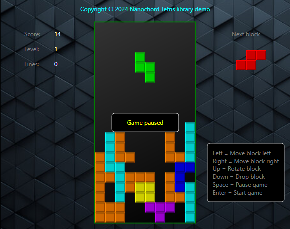

# Tetris

Simple Tetris game library.

This library was originally made for an Arduino based GameBox hardware. However, the solution had been platform independent, therefore, it can be applied in other solutions, as well.
There can be found demo applications in the repository so as to show how can it be used in different environments.

## How to use?

In C++ simply include the Tetris.h header file. The tetris enums and classes are within the **Nanochord** namespace. The **Nanochord:Host** abastract class must be implemented by the host code.

In C# use the Tetris.cs in your project similar to the C++ version.

```cpp
#include "Tetris.h"

const int ROW_COUNT = 20;
const int COL_COUNT = 20;

class MyHost: public Nanochord::Host
{
    // your custom platform imeplementation goes here...
    ...
}

MyHost host;
Nanochord:Tetris tetris(&host, ROW_COUNT, COL_COUNT);

tetris.Start();

while (!tetris.GetGameOver())
{
  // Game control logic goes here...
  // tetris.MoveLeft();
  // tetris.MoveRight();
  // tetris.Rotate();
  // tetris.Drop();
  // tetris.Pause();

  if (is_time_to_run)
    tetris.Run();
}
```


## Demos

**Console application**

This console application demonstrates how can a Console application based game be made with the library using Visual Studio. This demo application can only be run on Windows.


**Arduino**

This demo sketch would like to demonstrate how can a simple game be developed with an Arduino Uno and an RGB TFT display shield. The game can be controlled through the Serial Monitor embedded in the Arduino IDE.

This demo application is based on the following 3rd party libraries:
- Adafruit GFX Library
- MCUFRIEND_bkv
- UTFTGLUE


**C# WPF Application**

The WpfTetrisDemo project demonstrates the C# version of the library through a WPF application.


